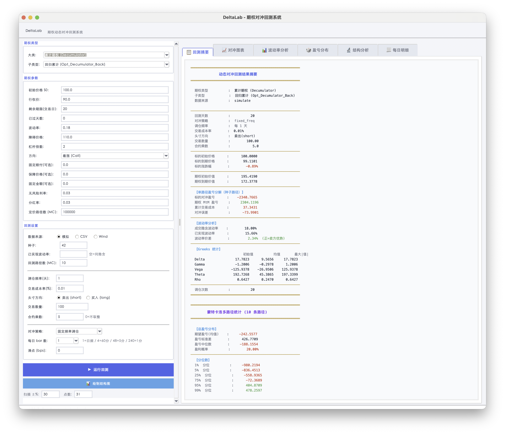

# DeltaLab


[](https://www.python.org/downloads/)
[](LICENSE)
[](https://github.com/Grefer/DeltaLab/commits/master)
[](https://github.com/Grefer/DeltaLab/issues)

> 基于 Python / tkinter 的期权 Delta 动态对冲回测框架，支持多种奇异期权、多数据源接入、日内多频率调仓与蒙特卡洛分析。

---

## ✨ 功能特性

- **4 大类期权**：香草 (Vanilla)、累计 (Decumulator)、亚式 (Asian)、气囊 (Airbag)，共 13 种子类型
- **3 种数据源**：蒙特卡洛模拟 / CSV 历史行情 / Wind 实时终端
- **2 种对冲策略**：固定频率 (`fixed_freq`) / 波动率触发 (`sigma_band`)
- **日内多频率**：支持日频 / 60 分 / 5 分 / 1 分级别的对冲模拟（`steps_per_day ∈ {1,4,48,240}`）
- **独立路径采样**：多路径 MC 采样为每条路径注入独立 `mc_seed`，避免样本相关性压窄分布
- **完整可视化**：6 宫格对冲图表、波动率分析、蒙特卡洛盈亏分布、结构扫描、每日明细导出
- **真实行情缩放**：CSV / Wind 模式下，以真实首日价为锚点自动缩放期权参数（行权价、障碍、保底等），保持结构一致性

## 📸 界面预览



> 上图：Decumulator 回测运行结果，左侧为参数面板，右侧为回测摘要 / 对冲图表 / 波动率分析 / 盈亏分布等标签页。

## 🗺️ 工作流概览


## 🚀 快速开始

### 环境要求

- **Python 3.10+**（使用了 `match/case` 语法）
- 推荐 3.11 或更高版本

### 安装依赖

```bash
pip install -r requirements.txt
```

> Wind 数据源为可选依赖，需安装 Wind 终端 + Python 插件（`WindPy`）。模拟和 CSV 模式无需 Wind。

### 启动 GUI

```bash
python gui_app.py
```

窗口默认大小 1600×1000，最小 1200×720。启动后会自动加载 [assets/deltalab.ico](assets/deltalab.ico)（Windows）或 [assets/deltalab.png](assets/deltalab.png)（macOS / Linux）作为窗口图标。

### 跑第一次回测

1. **期权类型** → 选 `香草期权 (Vanilla)`
2. **期权参数** → 保留默认（ATM Call, 22 天, σ=0.18）
3. **回测设置** → 数据来源选 `模拟`，模拟路径数改为 `500`
4. 点击 **▶ 运行回测**
5. 查看 `回测摘要` / `对冲图表` / `波动率分析` / `盈亏分布` 等标签页

## 📁 项目结构

```
DeltaLab/
├── gui_app.py        # GUI 入口 (tkinter + matplotlib)
├── pricing/          # 核心定价与回测引擎 (期权类 / MC / HedgeBacktest)
├── tests/            # 测试
├── data/cache/       # Wind 数据缓存 (运行时生成)
├── assets/           # 图标 / banner / 工作流示意图
├── tools/            # 资源生成脚本 (make_icon / make_banner / make_workflow)
└── docs/             # 深度文档 (GUI_USAGE.md)
```

文件级结构、各 `Option_*` 的定价方式、引擎内部接口等细节见 [docs/GUI_USAGE.md](docs/GUI_USAGE.md)。

## 📊 支持的期权类型

可以通过点击 **📊 绘制结构图** 查看期权结构说明与 Greeks 扫描曲线。

| 大类 | 子类型数 | 定价方式 |
|---|---|---|
| 香草期权 (Vanilla) | 1（`Eu`） | Black-Scholes 封闭解 |
| 累计期权 (Decumulator) | 9（回归 / 增强 / ASGQ 系列） | 蒙特卡洛 |
| 亚式期权 (Asian) | 2（`Asian`, `EnhanceAsian`） | 蒙特卡洛 |
| 气囊期权 (Airbag) | 1（`Opt_Airbag`） | 蒙特卡洛 |

子类型完整清单与 payoff 公式见 [docs/GUI_USAGE.md §4.1](docs/GUI_USAGE.md)。

## 🔧 技术栈

**Python 3.10+** · **tkinter + ttk** (GUI) · **matplotlib** (图表) · **numpy / scipy** (定价) · **pandas** (数据) · **WindPy** (实时行情, 可选) · **ThreadPoolExecutor** (多路径 MC)

## 📖 详细文档

完整的 GUI 操作手册（含每个参数的含义、单位、默认值与对结果的影响）请参阅：

👉 [**docs/GUI_USAGE.md**](docs/GUI_USAGE.md)

## 💬 反馈与贡献

发现 bug、想提需求或想贡献代码，欢迎开 [GitHub Issue](https://github.com/Grefer/DeltaLab/issues) 或直接提 PR。

## 📄 License

[MIT License](LICENSE) © Grefer
