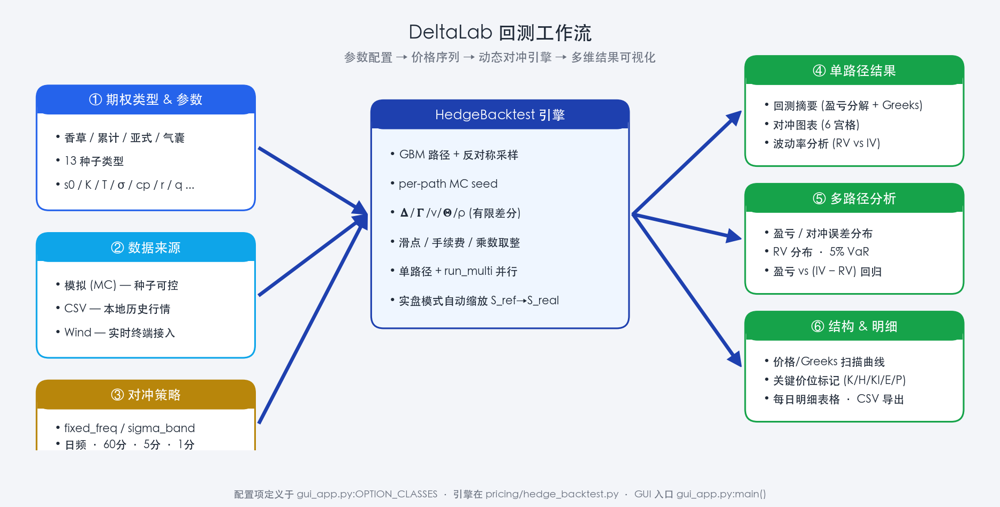

# DeltaLab


[](https://github.com/Grefer/DeltaLab/releases/latest)
[](https://www.python.org/downloads/)
[](LICENSE)
[](https://github.com/Grefer/DeltaLab/actions/workflows/tests.yml)
[](https://github.com/Grefer/DeltaLab/commits/master)
[](https://github.com/Grefer/DeltaLab/issues)

> 基于 Python / tkinter 的期权 Delta 动态对冲回测框架，支持多种奇异期权、多数据源接入、日内多频率调仓与蒙特卡洛分析。

---

## ✨ 功能特性

- **5 大类期权** —— 香草 (Vanilla)、累计 (Decumulator)、亚式 (Asian)、气囊 (Airbag)、雪球 (Snowball)，共 18 种子类型
- **3 种数据源** —— 蒙特卡洛模拟 / CSV 历史行情 / Wind API；CSV 一键生成行情模板，选好文件即读表头列出可用价格列，不必对着文档猜格式
- **3 种对冲触发方式** —— 每日收盘、每日固定时刻、固定价格间隔（绝对价格、相对价格、日波动 σ 三种口径可在参考点互相换算），外加一个全局的每日收盘兜底开关
- **智能行情粒度** —— 真实行情的每日 bar 数由时间索引与交易 session 自动推导，Wind 请求粒度按策略自动选择，不提供手工调粗（调粗只会静默漏掉 bar 内触发，让结论偏乐观）
- **回测结果池** —— 逐次回测后按需保留，自动存本机、重开仍在；勾选任意组合即时对比，并说清这次的变量差在哪一项
- **策略优选** —— 用 CSV / Wind 真实历史严格连续回放近周至近年五档周期，以每日收盘为固定基准按增量收益 / 增量信噪比排名，可把胜出参数一键写回左侧
- **完整可视化** —— 6 宫格对冲图表、波动率分析、蒙特卡洛盈亏分布、结构扫描；每日明细只展示并导出对冲触发记录
- **真实行情缩放** —— CSV / Wind 模式下以首日价为锚点等比例缩放行权价、障碍价、赔付金额等，保持结构的相对一致性

## 🗺️ 工作流概览



## 🚀 快速开始

### 环境要求

- **Python 3.10+**（使用了 `match/case` 与 PEP 604 union 语法），推荐 3.11 或更高版本
- Wind 数据源为可选依赖，需安装 Wind 终端 + Python 插件（`WindPy`）；模拟和 CSV 模式无需 Wind

### 安装并启动

```bash
pip install -r requirements.txt
```

```bash
python gui_app.py
```

窗口默认大小 1600×1000，最小 1200×720，启动时自动加载 [assets/](assets/) 下的窗口图标。

### 第一次回测

1. **期权类型** → 选 `香草期权 (Vanilla)`
2. **期权参数** → 保留默认（ATM Call, 22 天, σ=0.18）
3. **回测设置** → 数据来源选 `模拟`，模拟路径数改为 `500`
4. 点击 **▶ 运行回测**，结果出现在右侧 `📋 回测摘要` 等标签页
5. 点击 **＋ 保留当前结果到对比**，改一下对冲策略后再跑一次并保留
6. 打开 **🆚 结果对比**，勾选两条快照即时对照曲线与指标

每一步的预期结果见 [使用文档 §5](docs/GUI_USAGE.md#5-一次完整回测的操作流程)。

### 📦 下载预编译版本

Windows / macOS (Apple Silicon) 用户可直接从 [Releases](https://github.com/Grefer/DeltaLab/releases) 下载免安装包（无需 Python 环境）：

- `DeltaLab-vX.Y.Z-windows-x86_64.zip` — 解压后双击 `DeltaLab.exe`
- `DeltaLab-vX.Y.Z-macos-arm64.zip` — Apple Silicon (M 系列)

> macOS 首次打开若提示"未知开发者"，请在 `访达 → 应用程序` 中 **右键 → 打开**，或在 `系统设置 → 隐私与安全性` 中允许。
>
> Intel Mac 用户请从源码运行（见上方"安装并启动"）。
>
> CI 产出的发布包不内置 WindPy（GitHub runners 上没有 Wind 终端），改为**运行时自动发现本机 Wind 安装**：只要这台机器装了 Wind 金融终端并在终端里设置过 Python 接口，选 Wind 数据源即可直连。装在非常规位置时，用环境变量 `DELTALAB_WIND_DIR` 指向含 `WindPy.py` 的目录。详见 [使用文档 §1.3](docs/GUI_USAGE.md#13-可选依赖)。

## 📊 支持的期权类型

点击 **📊 绘制结构图** 可查看期权结构说明与 Greeks 扫描曲线。

| 大类 | 子类型数 | 定价方式 |
|---|---|---|
| 香草期权 (Vanilla) | 1（欧式） | Black-Scholes 封闭解 |
| 累计期权 (Decumulator) | 13（敲出终止 / 计零 / 增强 + 熔断保障 / 熔断赔付 两族） | 蒙特卡洛 |
| 亚式期权 (Asian) | 2（亚式, 增强亚式） | 蒙特卡洛 |
| 气囊期权 (Airbag) | 1（气囊） | 蒙特卡洛 |
| 雪球期权 (Snowball) | 1（雪球 / 反雪球） | 蒙特卡洛 |

子类型完整清单、各自的参数与 payoff 公式见 [使用文档 §4.1–4.2](docs/GUI_USAGE.md#41-期权类型)。

## 🧭 三条使用路径

| 页面 | 回答的问题 | 文档 |
|---|---|---|
| 单次回测 | 这一组参数跑出来是什么样 | [§4](docs/GUI_USAGE.md#4-参数详解) · [§6.1–6.6](docs/GUI_USAGE.md#6-结果解读) |
| `🆚 结果对比` | 我手里这几条结果差在哪一项 | [§6.7](docs/GUI_USAGE.md#67-回测结果对比) |
| `🎯 策略优选` | 真实历史上哪种触发方式更值 | [§6.8](docs/GUI_USAGE.md#68-策略优选) |

后两者口径不同、结果不会混排：结果对比只读已完成的快照、不设固定基准；策略优选会真的重跑回测，并固定以每日收盘 C2C 为基准。

## 📁 项目结构

```
DeltaLab/
├── gui_app.py              # GUI 入口 + 兼容 re-export (tkinter + matplotlib)
├── deltalab_ui/            # 界面层，按功能域拆分 (主题 / 表单 / 各结果页 / 落盘)
├── history_selection.py    # 策略优选纯逻辑 (候选空间 / 校验 / 排名与图表模型)
├── history_store.py        # 策略优选结果包的落盘存取
├── backtest_pool_store.py  # 回测结果池的落盘存取
├── history_bar_cache.py    # 分段 bar 级明细的内容寻址缓存
├── pricing/                # 核心定价与回测引擎 (期权类 / MC / HedgeBacktest / 择优)
├── tests/                  # pytest 用例 (需要真实窗口的带 gui marker)
├── data/                   # 交易日历、行情缓存与结果包 (运行时生成)
├── assets/                 # 图标 / banner / 工作流示意图
├── tools/                  # 资源生成与数据探针脚本
└── docs/GUI_USAGE.md       # 完整使用与口径文档
```

`data/` 下具体写了哪些东西、哪些能随便删，见 [使用文档 §1.6](docs/GUI_USAGE.md#16-数据与结果落在哪里)；`pricing/` 各文件的职责见使用文档末尾的「相关源码」。

`deltalab_ui/` 的拆分有两条硬规则：**依赖方向单向**（`gui_app` → `deltalab_ui`，包内模块一律不 import `gui_app`），**包级不做 re-export**（`__init__` 保持空壳，避免 `theme` 的 import 期副作用在意想不到的时机触发）。`gui_app.py` 保留为兼容入口，外部与测试继续写 `gui_app.XXX` 即可。

## 🔧 技术栈

**Python 3.10+** · **tkinter + ttk** (GUI) · **matplotlib** (图表) · **numpy / scipy** (定价) · **pandas / pyarrow** (数据) · **WindPy** (实时行情, 可选) · **ThreadPoolExecutor** (多路径 MC)

## 🧪 测试

```bash
pytest -m "not gui" -q
```

裸跑 `pytest` 即可跑全量。带 `gui` marker 的用例会构造真实 `tk.Tk` 根窗口，拿不到窗口服务器时 Tk 是整进程 abort 而非抛异常，因此无显示环境要用 `-m "not gui"` 排除，Linux 下用 `xvfb-run -a` 补跑那一批。CI 在 ubuntu × Python 3.10 / 3.13 上跑全量，见 [tests.yml](.github/workflows/tests.yml) 与 [使用文档 §1.7](docs/GUI_USAGE.md#17-跑测试)。

## 📖 详细文档

README 只讲这个工具是什么、怎么装、怎么跑起来。**每个参数的含义、单位、默认值，各页面的计算口径与取舍，以及常见报错的成因**，都在使用文档里：

👉 [**docs/GUI_USAGE.md**](docs/GUI_USAGE.md)

每个版本改了什么、有没有需要迁移的东西，见 [**CHANGELOG.md**](CHANGELOG.md)。

## 💬 反馈与贡献

发现 bug、想提需求或想贡献代码，欢迎开 [GitHub Issue](https://github.com/Grefer/DeltaLab/issues) 或直接提 PR。

## 📄 License

[MIT License](LICENSE) © Grefer
